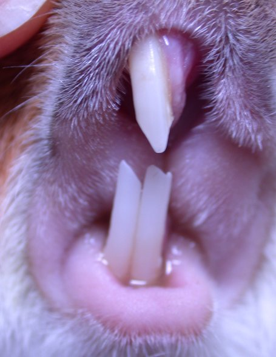

```{r setup, include=FALSE}
# R options
options(
  htmltools.dir.version = FALSE, # for blogdown
  show.signif.stars = FALSE,     # for regression output
  warm = 1
  )
# Set dpi and height for images
library(knitr)
knitr::opts_chunk$set(fig.height = 2.65, dpi = 300,fig.align='center',fig.show='hold',size='footnotesize', small.mar=TRUE) 
# For nonsese...
htmltools::tagList(rmarkdown::html_dependency_font_awesome())
```

```{r echo=FALSE, message=FALSE, warning=FALSE}
library(tidyverse)
library(rvest)
```


## R's most exciting data

We are going to explore R's most thrilling data -- the famous tooth growth in Guinea pigs data!


```{r echo=FALSE, out.height="350px",out.width="550px"}
knitr::include_graphics("img/olivertwist.jpg")
```


Ahh, how cute!  Our Dickensian guinea pig has a mystery to solve -- which type of Vitamin C supplement is best for tooth growth!


---
## R's most exciting data

```{r echo=FALSE, out.height="200px",out.width="200px"}

```


Guinea pig dental problems are NOT fun. 

Our dataset (Crampton, 1947) contains, as a response, the length of odontoblasts (cells responsible for tooth growth) in 60 guinea pigs, each of which receives one dose of vitamin C (0.5, 1, or 2 mg/day) via one of two delivery methods (orange juice (OJ) or ascorbic acid (VC)).

Researchers wanted to know if the odontoblast length could be used as a marker of Vitamin C uptake, for the purposes of providing better nutritional supplementation to members of the Canadian armed forces (alas, the first of many injustices for Oliver Twisted Teeth -- the study was not done to help little Guinea piggies).


---
## R's most exciting data


```{r guineadescriptives0,echo=TRUE, eval=FALSE}
library(ggplot2)
gp=ToothGrowth
gp$dose=as.factor(gp$dose)
# Default bar plot
p<- ggplot(gp, aes(x=dose, y=len, fill=supp)) + 
  geom_bar(stat="identity", position=position_dodge()) 
# Finished bar plot
p+labs(title="Odontoblast length by dose", x="Dose (mg)", y = "Length")+
   theme_classic() +
   scale_fill_manual(values=c('#999999','#E69F00'))

```


---
## R's most exciting data

```{r guineadescriptives,echo=FALSE, warning=FALSE, fig.height=3.6}
library(ggplot2)
gp=ToothGrowth
gp$dose=as.factor(gp$dose)
# Default bar plot
p<- ggplot(gp, aes(x=dose, y=len, fill=supp)) + 
  geom_bar(stat="identity", position=position_dodge()) 
# Finished bar plot
p+labs(title="Odontoblast length by dose", x="Dose (mg)", y = "Length")+
   theme_classic() +
   scale_fill_manual(values=c('#999999','#E69F00'))

```

Looking at the boxplot of the growth data, what type of ANOVA model may be most appropriate?


---
## Your task!

1. Specify an ANOVA model for the data.
2. Under your ANOVA model, write out (in terms of parameters) the means for each combination of supplement type and dose.
3. Fit your model and provide a $\leq$ very short summary of the analysis in language accessible to the general public.
4. Suppose that greater lengths are indicative of better absorption. Make a recommendation for the dose(s) and supplement type(s) to be used to deliver vitamin C to armed forces members, assuming that the goal is to maximize absorption of vitamin C. Use statistical evidence to support your recommendation.
5. Conduct diagnostic checks to see how well the assumptions behind your model are satisfied. Are there any reasons for concern about your model choice?


---

class: center, middle

# What's next? 

### Move on to the readings for the next module!


